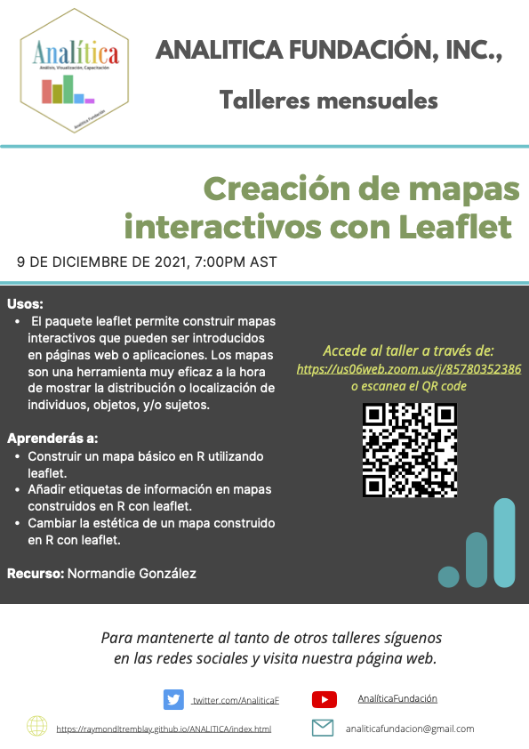

***

# Introducción a Mapas Interactivos con **Leaflet** 

- Dia del Taller: el 9 de diciembre, 2021
- Recurso: Normandie Gonzalez_Orrelana
- Asociación Académida: **Universidad de Puerto Rico- Rio Piedras, Estudiante Graduada**
- Correo electronico: normandie.gonzalez@upr.edu


***

## ¿Mapas Interactivos con **Leaflet**?

 > 


***

## Video de la Presentación

# Enlaces para acceso a los Videos en el Canal de YOUTUBE ANALITICA Fundación

Los sigientes enlaces corresponde a la presentación abajo

[Video_1](https://www.youtube.com/watch?v=ylUR8POEh-s)

[Video_2](https://www.youtube.com/watch?v=FP347p404ME)

[Video_3](https://www.youtube.com/watch?v=98vR0agbAcA)

[Video_4](https://www.youtube.com/watch?v=diYVZVtX9KA)


***

```{=html}
<style>
body {
text-align: justify}
</style>
```
# Importación de Paquetes y Datos

```{r}
library(tidyverse)
library(leaflet)
library(rinat)
library(RColorBrewer)
```

**Obtener los datos de observaciones de una especie en iNaturalist desde R:**

Los datos a utilizar se obtendrán desde iNaturalist, una aplicación con base en la ciencia ciudadana que mantiene un registro de ocurrencias de especies. Lo primero, antes de acceder a lo datos de iNaturalist, es crear un objeto que contenga los límites geográficos de interés. iNaturalist se encuentra a nivel mundial, y usted puede acceder a todos esos datos. Sin embargo, hoy accederemos solamente a datos de Puerto Rico. En el caso de iNaturalist, no existe una variable de País, si no una variable llamada *place_guess* que da el país junto con otra información poco consistente. Hacer un filtrado de los datos utilizando esta variable sería demasiado complicado, pero es posible hacerlo de forma rápida y sencilla utilizando las coordenadas del área de interés especificadas en un cuadro delimitador (*bounding box*).

```{r}
cajapr <- c(
  17.75, #Latitud Sur
   -67.4, #Longitud Oeste
  18.75, #Latitud Norte
  -65.15 #Longitud Este
  )
```

La función `get_inat_obs()` permite acceder a los datos disponibles en iNaturalist, especificando los siguientes parámetros:

-   `taxon_name`: La especies de interés, siempre escrita entre comillas ("). Puede utilizar nombre común o científico.

-   `quality`: Siendo una aplicación basada en ciencia ciudadana, la calidad de algunos datos podría ser baja, debido a que les falta información - como nombre científico o ubicación - o que contienen información errónea - especies mal identificadas-. Colocando `'research'` en este parámetro se especifica que se desea obtener sólo aquellas observaciones con alta calidad - que tengan información completa y cuya identificación haya sido confirmada por varias personas de la comunidad -.

-   `geo`: Al igual que el parámetro `quality`, este parámetro cuyo valor es lógico (`TRUE` o `FALSE`), es para especificar que se quiere obtener sólo los datos que están georeferenciados (cuando se coloca como `TRUE`).

-   `maxresults`: A través del API (Interfaz de Programación de Aplicaciones) de iNaturalist se puede acceder a un máximo de 10,000 observaciones en una sola búsqueda. Con este parámetro, cuyo valor debe ser numérico, se especifica cuantas observaciones se desea obtener, y no se debe exceder de 10,000 por búsqueda.

-   `bounds`: Un vector que contiene los límites geográficos de la búsqueda. Se puede insertar un cuadro delimitador ya especificado en un objeto, concatenar los valores del vector, o insertar un objeto de características simples (Simple Feature, sf).

```{r}

oeceoclades <- get_inat_obs(taxon_name = "Oeceoclades maculata", 
                            quality = 'research', 
                            geo = T, 
                            maxresults = 10000, 
                            bounds = cajapr)

head(oeceoclades) # Para observar las primeras seis líneas del data.frame
```

# Utilizando Leaflet

La función base del paquete leaflet es `leaflet()`, con esta se activa un artilugio (*widget* en inglés) sobre el cuál se construye el mapa. Esta función debe estar unida a otra función como `addTiles()` que añade el mapa.

```{r}
leaflet() %>% 
  addTiles() 
```

Una vez tenemos el artilugio y el mapa, añadimos una capa que incluye los datos que se desean visualizar con marcadores sobre el mapa con la función `addMarkers()` dentro del cual se deben especificar los parámetros `lng` (longitud) y `lat` (latitud). Note que también se especifica el data.frame que contiene los datos bajo la función `leaflet()`. Cuando se trabaja en Leaflet, al especificar las variables a utilizar, es necesario colocar una virgulilla (\~) antes de la variable. Esto le deja saber a R que lo que se especifica es una variable dentro del data.frame.

```{r}
leaflet(oeceoclades) %>% 
  addTiles() %>% 
  addMarkers(lng = oeceoclades$longitude, 
             lat = oeceoclades$latitude)
```

Una vez los marcadores están establecidos, es posible añadir etiquetas que contengan información acerca de las observaciones con el parámetro `popup` de la función `addMarkers()`. Por ejemplo, se pueden colocar etiquetas que contengan información del lugar de la observación especificando que la etiqueta contenga la información de la variable *place_guess*. Para ver la etiqueta debe hacer clic sobre el marcador de interés.

```{r}
leaflet(oeceoclades) %>% 
  addTiles() %>% 
  addMarkers(lng = ~ longitude, 
             lat = ~ latitude, 
             popup = ~ place_guess)
```

La función `paste0` es una función base de R que concatena todos los elementos en una línea de caracteres. Los caracteres introducidos serán interpretados como UTF-8 o codificación de caracteres. Estos caracteres pueden ser mezclados con valores de una variable de caracteres en un data.frame. En el siguiente ejemplo se crea una etiqueta que contiene la ubicación y el nombre de la persona que hizo la observación. Se utiliza la función `paste0()` para combinar caracteres y las variables *place_guess* y *user_login* del data.frame.

```{r}
leaflet(oeceoclades) %>% 
  addTiles() %>% 
  addMarkers(lng = ~ longitude, 
             lat = ~ latitude, 
             popup = paste0("<B>Ubicación: </B>", oeceoclades$place_guess,
                            "<br/>",
                            "<B>Colectado por: </B>", oeceoclades$user_login)
               )
```

La función `addAwesomeMarkers()` puede ser utilizada en lugar de `addMarkers()` y permite utilizar marcadores con diferentes diseños que se pueden obtener de varias páginas web como [fontawesome](https://fontawesome.com/v5.15/icons?d=gallery&p=1). Es posible cambiar los colores de los marcadores utilizando la codificación de colores de [schemecolor](https://www.schemecolor.com/github-cat-icon-colors.php). Para hacer estos cambios utilizamos la función `awesomeIcons()` bajo el parámetro `icon` dentro de `addAwesomeMarkers()`. Dentro de la función `awesomeIcons()` podemos especificar varios parámetros como:

-   `icon`: El icono que desea utilizar para su marcador. Debe poner el nombre que aparece en la página web de iconos que esté utilizando (*i.e.*, fontawesome).

-   `library`: Cuando se especifica un icono, es necesario especificar la biblioteca de donde se saca el icono. Si es de fontawesome sería `'fa'`.

-   `markerColor`: Para cambiar el color del marcador (parte que rodea el icono), utilizando la codificación de colores de schemecolor.

-   `iconColor`: Para cambiar el color del icono del marcadora, también con la codificación de schemecolor.

```{r}
leaflet() %>% 
  addTiles() %>% 
  addAwesomeMarkers(lng = oeceoclades$longitude, lat = oeceoclades$latitude, 
             popup = paste0("<B>Ubicación: </B>", oeceoclades$place_guess,
                            "<br/>",
                            "<B>Colectado por: </B>", oeceoclades$user_login),
            icon = awesomeIcons(icon = "leaf", library = "fa", 
                                markerColor = "red",
                                iconColor =  "#FFFFFF")
               ) 
```

Cuando se visualiza una gran cantidad de datos, esto puede resultar en el solapamiento de los marcadores, lo cual no es muy agradable a la vista. Es posible crear agregados que ayuden a visualizar mejor y faciliten el movimiento a través del mapa con el parámetro `clusterOptions` bajo la función `addAwesomeMarkers()`. El valor de este parámetro debe ser la función `markerClusterOptions()`.

```{r}
leaflet() %>% 
  addTiles() %>% 
  addAwesomeMarkers(lng = oeceoclades$longitude, lat = oeceoclades$latitude, 
             popup = paste0("<B>Ubicación: </B>", oeceoclades$place_guess,
                            "<br/>",
                            "<B>Colectado por: </B>", oeceoclades$user_login),
            icon = awesomeIcons(icon = "leaf", 
                                library = "fa", 
                                markerColor = "red",
                                iconColor =  "#FFFFFF"),
            clusterOptions = markerClusterOptions()
               ) 


```

Y para culminar, es posible cambiar el diseño del mapa utilizando la función `addProviderTiles()` en lugar de `addTiles()`. Puede echar un vistazo a los diferentes diseños disponibles para Leaflet la página de [proveedores de Leaflet](http://leaflet-extras.github.io/leaflet-providers/preview/) en GitHub. Actualmente Leaflet en R admite diseños de los siguientes proveedores: OpenStreetMap, MapQuestOpen, Stamen, Esri and OpenWeatherMap.

```{r}
leaflet() %>% 
  addProviderTiles("Esri.WorldImagery") %>% 
  addAwesomeMarkers(lng = oeceoclades$longitude, 
                    lat = oeceoclades$latitude, 
             popup = paste0("<B>Ubicación: </B>", oeceoclades$place_guess,
                            "<br/>",
                            "<B>Colectado por: </B>", oeceoclades$user_login),
              icon = awesomeIcons(icon = "leaf", 
                                library = "fa", 
                                markerColor = "red",
                                iconColor =  "#FFFFFF"),
            clusterOptions = markerClusterOptions()
               )
```

# Trabajando Variables Categóricas con Leaflet:

Obtener un nuevo data.frame de iNaturalist, esta vez para *Eulophia maculata* en Puerto Rico.

```{r}
eulophia <- get_inat_obs(taxon_name = "Eulophia graminea", quality = 'research', geo = T, meta = F, maxresults = 10000, bounds = cajapr)

head(eulophia)
```

Con el paquete tidyverse es posible unir el data.frame de *Oeceoclades* con el de *Eulophia* porque ambos tienen el mismo formato. Con la función `bind_rows()` unimos las filas de ambos data.frames. Con la función `mutate()`, también de tidyverse, es posible crear una nueva columna en este set de datos. Ahora bien, la creación de una nueva columna dependerá del nombre que se le de: si se le da un nombre nuevo - o sea, diferente al de las demás columnas presentes en el data.frame -, se creará una columna nueva; si se nombra la columna con un nombre ya existente, se sustituirán los valores de dicha columna por los especificados en la función. Entonces se puede utilizar `mutate()` para transformar la columna *scientific_name* a una que contiene valores factoriales, utilizando la función `as.factor()` para especificar que los valores sean sustituidos por los valores ya conocidos interpretados como factores.

Este nuevo set de datos combinados será guardado en un nuevo objeto llamado *introducidos*.

```{r}
introducidos <- bind_rows(oeceoclades, eulophia) %>% 
  mutate(scientific_name = as.factor(scientific_name))

head(introducidos)
```

Ahora que se está trabajando con dos especies diferentes, es posible distinguir entre especies utilizando diferentes colores, pero debe utilizar la función `addCircleMarkers()` en lugar de `addAwesomeMarkers()`. Para colorear grupos en Leaflet es necesario generar una paleta de colores para las variables de interés de acuerdo al tipo de variable (*i.e.*, numérica, factorial). Para esto se utilizan las funciones `colorFactor()`, `colorNumeric()`, `colorBin()`, o `colorQuantile()`. `colorFactor()` y `colorNumeric()` generan paletas de colores para variables factoriales y numericas, respectivamente; mientras que `colorBin()` y `colorQuantile()` generan paletas de colores para valores numéricos resumidos en grupos.

En este caso se está trabajando con una variable factorial que divide las observaciones entre dos especies de orquídeas introducidas.Primero se crea una paleta de colores para una variable factorial con la función `colorFactor()`. Bajo esta función se especifican los parámetros `palette` y `levels`. `palette`es para especificar la paleta de colores a utilizar y `levels`especifica los niveles de la variable factorial. La paleta de colores que se utiliza (`"RdYlBu"`) proviene del paquete RColorBrewer. Esta paleta de colores para los niveles de la variable factorial *scientific_name* del data.frame *introducidos* se guardará en un objeto llamado *pal*.

```{r}
pal <- colorFactor(palette = 'RdYlBu',
            levels = introducidos$scientific_name)
```

Ahora que se ha especificado los colores para los valores factoriales, es posible utilizar el objeto pal para colorear los marcadores circulares del mapa de Leaflet de acuerdo a la especie observada especificando el parámetro color

```{r}
leaflet(introducidos) %>% 
  addTiles() %>% 
  addCircleMarkers(lng = ~ longitude, lat = ~ latitude,
                   popup = paste0("<B>Location: </B>",
                                  introducidos$place_guess,
                                  "<br/>",
                                  "<B>Collector: </B>",
                                  introducidos$user_login),
                   color = ~ pal(scientific_name)) %>% 
  addLegend(position = "topright", 
            pal = pal, 
            values = ~ scientific_name,
            title = "Species"
            )

```

Para ayudar con la visualización de datos pertenecientes a diferentes grupos, en ocasiones es bueno presentar una leyenda que indique los colores que representan cada grupo. Es posible añadir una leyenda al mapa de Leaflet utilizando la función `addLegend()` y especificando los siguientes parámetros:

-   `position`: Para determinar la posición de la leyenda, en este caso se colocará en la parte superior derecha, `"topright"`, del mapa, pero podría colocarla en la parte inferior derecha (`"bottomright"`), la parte inferior izquierda (`"bottomleft"`), o la parte superior izquierda (`"topleft"`).

-   pal: La paleta de colores a utilizar generada a través de la función `colorFactor()` o sus equivalentes (*i.e.*, `colorNumeric()`)

-   `values`: Los valores o la variable u objeto que contiene los valores utilizados.

-   `title`: El título de la leyenda especificado como una línea de caracteres.

```{r}
leaflet(introducidos) %>% 
  addTiles() %>% 
  addCircleMarkers(lng = ~ longitude, lat = ~ latitude,
                   popup = paste0("<B>Location: </B>",
                                  introducidos$place_guess,
                                  "<br/>",
                                  "<B>Collector: </B>",
                                  introducidos$user_login),
                   color = ~ pal(scientific_name)) %>% 
  addLegend(position = "topright", 
            pal = pal, 
            values = ~ scientific_name,
            title = "Species"
            )
```


## Recursos Suplementario


### Anuncio del taller



