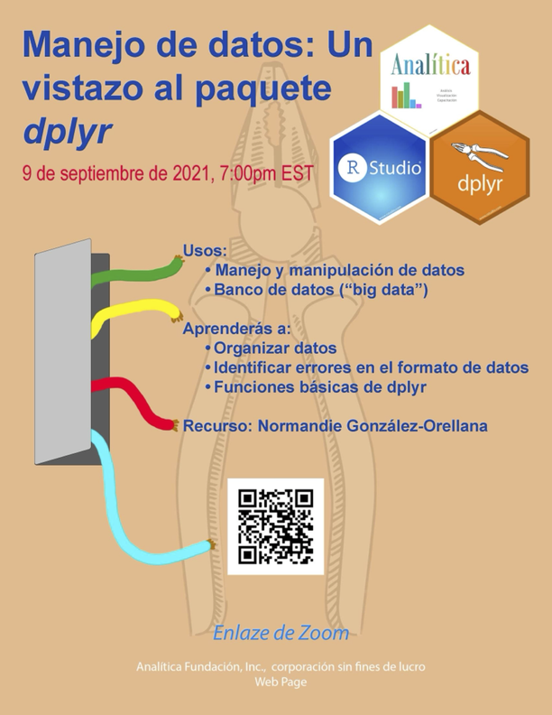

```{r setup, include=FALSE}
knitr::opts_chunk$set(echo = TRUE)
```

```{=html}
<style>
body {
text-align: justify}
</style>
```


***

# Manejo de datos: Un vistazo al paquete **dplyr**

- Dia del Taller: el 9 de septiembre, 2021
- Recurso: Normandie Gonzalez_Orrelana
- Asociación Académida: **Universidad de Puerto Rico- Rio Piedras, Estudiante Graduada**
- Correo electronico: normandie.gonzalez@upr.edu


***

## Video de la Presentación

# Enlaces para acceso a los Videos en el Canal de YOUTUBE ANALITICA Fundación

Los sigientes enlaces corresponde a la presentación abajo

[Video_1](https://www.youtube.com/watch?v=HRxLAfVbSI4)


***


## Recursos Suplementario


Encontrarán el archivo de datos en el siguiente [enlace](DATA/PsychilisFALSE.xlsx)


### El Proceso de la Ciencia de Datos

```{r Proceso Ciencia de Datos Figura, echo=FALSE, fig.align='center'}
knitr::include_graphics("Graficos/CienciaDatosProcesos.jpeg")
```

La Ciencia de Datos es una disciplina amplia y multidisciplinaria que combina el método científico, la ciencia de cómputos y las matemáticas. La ciencia de datos conlleva un proceso cuyo meta final es la obtención de información y nuevos conocimientos de los datos disponibles. A continuación un resumen del proceso de la Ciencia de datos:

-   **Obtención de Datos:** La obtención de los datos puede ser desde cero mediante experimentación y/u observación. También se pueden utilizar datos disponibles de manera gratuita o no, a través de bases de datos. Otra forma de obtener datos es hacer una revisión de literatura y reunir datos disponibles en publicaciones previas.

-   **Limpieza o Procesamiento de Datos:** Muchas veces los datos obtenidos, independientemente de su fuente, necesitan ser limpiados y organizados antes de poder ser analizados. Por ejemplo, es posible tener una cantidad de datos mucho más grande de la necesaria o que los datos necesarios estén entrelazados con otra información superflua para los propósitos del estudio. Entonces, se utiliza herramientas de programación para filtrar los datos necesarios (limpiarlos) y deshacernos de esa información sobrante que podría entorpecer el análisis que se quiere realizar.

-   **Exploración:** Es sumamente importante, antes de realizar cualquier prueba estadística, conocer los datos disponibles. Características de los datos como cuántas variables, qué tipo de variables, distribución, si hay datos faltantes (*NA*'s), *etc*., son imprescindibles a la hora de escoger la prueba estadística o modelo a utilizar.

-   **Modelaje:** Una vez terminada la exploración de los datos se procede a utilizar pruebas estadísticas que se ajustan a los datos, o a construir y entrenar modelos que ayudan a contestar las preguntas de la investigación y/o a obtener información de los datos.

-   **Publicación:** Una vez seguro de que su modelo se ajusta bien a los datos, ha sido entrenado correctamente, y ha obtenido resultados, fiel al método científico, toca la publicación de los hallazgos. En el caso de un científico de datos, esto puede ser a través de una publicación en una revista científica, al público en general a través de la prensa, en una presentación en una conferencia, o simplemente escribiendo un reporte interno para la compañía o institución para la cuál trabaja.

En este taller nos concentraremos en la limpieza de datos. Presentaremos el paquete *dplyr* y algunas de sus funciones que son útiles para la limpieza y manejo de datos.

### Manejo de Datos con *dplyr*

El paquete *dplyr* provee una gama de funciones que ayudan con la manipulación y manejo de datos. En este taller se utilizará un grupo de datos pequeños, pero es importante tener en mente que la utilidad de estas funciones es directamente proporcional al tamaño de los datos con los que se trabaja. Es decir, cuando lo observamos a pequeña escala, puede parecer que sería mejor hacer la manipulación sin el uso del paquete (directamente en Microsoft *Excel*, por ejemplo); pero cuando se trabaja con bases de datos extensas con cientos de variables y miles de observaciones y/o cuando se trabaja con datos obtenidos de bases de datos que no son fáciles de manipular, contar con el paquete *dplyr* es una ventaja. Otra ventaja de manipular los datos en R utilizando el paquete *dplyr* es que estos cambios sólo suceden en la sesión de R, o sea que los datos originales permanecen inalterados.

Observe el grupo de datos en la Tabla 1:

```{r datos, echo = F, warning=FALSE, message=F}
library(data.table)
library(kableExtra)
library(readxl)
library(dplyr)


PsychilisFALSE <- read_excel("DATA/PsychilisFALSE.xlsx")

genero <- as.factor(c("Psychilis", "Psychilis", "Psichilis", "Psychils", rep("Psychilis", times = 17), "Pyschilis"))

especie <- as.factor(c("krugii", "kraenzlinii", "kraenzlinii", "krugii", "krugii", "kraenzlinii", "krugii", rep("kraenzlinii", times = 3), "krugii", "kraenzlinii", "krugii", "kraenzlinii", rep("krugii", times = 4), "kraenzlinii", "krugii", rep("kraenzlinii", times = 2)))

plot <- as.factor(c(rep("1", times = 10), rep("2", times = 12)))

huesped <- as.factor(c("tree", "tree", "shrub", "rock", "shrub", rep("tree", times = 4), "rock", "rock", "shrub", "tree", "rock", rep("tree", times = 3), "shrub", NA, "tree", "shrub", "tree"))

numero_de_hojas <- c(2,3,6,5,1,3,2,2,4,3,NA,3,5,2,4,1,2,7,5,3,4,2)

numero_de_frutos <- c(0,0,NA,0,1,1,0,2,0,0,NA,0,0,0,1,1,3,0,0,0,1,0)

datos <-data.frame(genero, especie, plot, huesped, numero_de_hojas, numero_de_frutos)

kbl(datos, caption = "<b>Tabla 1:</b> Datos obtenidos apartir de observación en el campo.", format = 'html', table.attr = "style = 'width:10%;'") %>%
   kable_paper(bootstrap_options = "striped", full_width = T) %>% 
  kable_styling(position = 'center') %>% 
  footnote(general = "Los datos aquí presntados fueron artificialmente creados para este taller y no son necesariamente representativos de la realidad.",
           general_title = "*", footnote_as_chunk = T)
```

Los datos de la tabla 1 contienen 6 variables y 22 observaciones. Las primeras 4 variables son factoriales y las últimas dos son numéricas. Una forma sencilla de saber qué tipo de variables tiene un grupo de datos es con la función `summary()`:

```{r}
summary(datos)
```

Pedirle un resumen de los datos a R con esta función quizá sea el mejor paso luego de importar los datos, pues nos permite tener una idea de la estructura de los datos y en ocasiones detectar errores rápidamente. Por ejemplo, en estos datos sólo se trabaja con un género de orquídeas, pero R está registrando 4; y con 2 especies, pero R está registrando 3. Esto se debe a errores ortográficos a la hora de la recolección y/o entrada de datos. Los errores ortográficos o la poca consistencia en la toma de datos es uno de los retos más comunes en la ciencia de datos. Los lenguajes de programación como R son sensitivos a la ortografía, y errores como este pueden afectar el análisis de los datos. El paquete *dplyr* y sus funciones `mutate()` y `recode()` pueden ayudar a resolver este asunto:

```{r}
library(dplyr)
library(forcats)

datos %>%
  mutate(genero = recode_factor(genero,
                                "Psichilis" = "Psychilis",
                                "Psychils" = "Psychilis",
                                "Pyschilis" = "Psychilis"))
```

Con la función `mutate()` se crea una nueva columna en un data.frame. Ahora bien, la creación de una nueva columna dependerá del nombre que se le asigne: si se le asigna un nombre nuevo - o sea, diferente al de las demás columnas presentes en el data.frame -, se creará una columna nueva; si se nombra la columna con un nombre ya existente, se sustituirán los valores de dicha columna por los especificados en la función. Con la función `mutate()` se le indica a R que se desea crear una nueva columna **genero** basada en la actual columna **genero**. Luego con la función `recode_factor()` se indica que esta nueva columna **genero** contiene los valores pasados de **genero** sustituidos todos por *Psychilis*.

Otra cosa que se podría arreglar en este data.frame, por cuestiones de comodidad, es el nombre de las columnas. El nombre de las columnas *numero_de_hojas* y *numero_de_frutos* es muy largo, y aunque esto no representa un problema para el análisis, es mucho más conveniente que los nombres de las columnas sean cortos. Los nombres cortos ayudan a la hora de escribir el código. Las función `rename()` puede ayudar a cambiar el nombre de las variables.

Preste especial atención a la sintaxis del código. En el caso de `recode_factor()`, primero se especifica el valor categórico que se desea re-codificar y luego el valor por el cuál se desea sustituir; mientras que en la función `rename()` primero se especifica el nombre que desea asignar y luego la columna a la cual quiere asignarle el nuevo nombre.

```{r}
datos %>%
  mutate(genero = recode_factor(genero,
                                "Psichilis" = "Psychilis",
                                "Psychils" = "Psychilis",
                                "Pyschilis" = "Psychilis")) %>% 
  rename(num_hojas = numero_de_hojas,
         num_frutos = numero_de_frutos)
```

Ahora que los datos están limpios, es conveniente guardar este grupo de datos en un objeto que se pueda seguir utilizando mientras se trabaje en la sesión corriente de R. En este caso se le llamará *datos_clean*:

```{r}
datos_clean <- datos %>%
  mutate(genero = recode_factor(genero,
                                "Psichilis" = "Psychilis",
                                "Psychils" = "Psychilis",
                                "Pyschilis" = "Psychilis")) %>% 
  rename(num_hojas = numero_de_hojas,
         num_frutos = numero_de_frutos)
```

Es posible que se obtengan más datos de los necesarios. Por ejemplo, quizá ha conseguido datos para el género *Psychilis*, pero solo hay interés en una especie de este género, *Psychilis* *kraenzlinii*, y para llevar acabo el análisis es necesario eliminar los datos de las otras especies. Para esto *dplyr* provee la función `filter()`:

```{r}
datos_clean %>% 
  filter(especie == "kraenzlinii")
```

Con esta función se le indica a R que sólo se desea trabajar con aquellas observaciones o líneas en las cuales la variable o columna *especie* es igual a *kraenzlinii*.

Con los datos ya limpios, puede utilizar *dplyr* para obtener un poco de información a partir de los datos. Por ejemplo, se puede saber el promedio del número de hojas por parcela (*plot*) utilizando la combinación de funciones `group_by()` y `summarize()`. Estas funciones van de la mano, ya que `group_by()` indica que se desea agrupar los datos por cierta variable - en este caso por la variable *plot* -; mientras que la función `summarize()` indica cómo resumir las demás variables para poder agruparlas - en este caso, se resumirá en una columna, *prom_num_hojas*, que contiene el promedio de la columna *num_hojas*. Es decir, R calculará el promedio del número de hojas para cada parcela.

```{r}
datos_clean %>% 
  filter(especie == "kraenzlinii") %>% 
  group_by(plot) %>% 
  summarize(prom_num_hojas = mean(num_hojas))
```

De hecho, puede agrupar y resumir por cuantas variables considere necesario:

```{r}
datos_clean %>% 
  group_by(genero, especie, plot) %>% 
  summarise(prom_num_hojas = mean(num_hojas),
            total_frutos = sum(num_frutos))
```

Algo interesante que se puede notar es los valores perdidos (*NA*s) en las columnas *prom_num_hojas* y *total_frutos*. Esto se debe a que los datos originales contienen *NA*s y estos a su vez interfieren con el cálculo del promedio y la suma, pues no son números. Hay dos formas de en las que se puede trabajar con esto, y escoger entre una u otra va a depender de cuán imprescindibles son los datos faltantes. Por ejemplo, ya desde el principio se detectaron los *NA*s al hacer un resumen de los datos. Si la ética se lo permite, es decir, si la eliminación de aquellas observaciones que contienen datos faltantes no influye en el resultado final de la investigación, puede eliminar fácilmente todas las observaciones que contienen *NA*s de sus datos utilizando la función `filter()`:

```{r}
datos_clean %>% 
  filter(!is.na(num_hojas), !is.na(num_frutos))
```

Con este código se le dice a R que filtre todo aquello que no es igual a *NA* (en el lenguaje de R, el signo de exclamación (!) significa *no es igual a*. La función `is.na()` evalúa cada una de las observaciones en la variable especificada para ver si es *NA.* Se puede guardar este nuevo grupo de datos en un nuevo objeto y aplicarle luego las funciones que quiera, o simplemente añadir una nueva línea de código para hacer la agrupación por especie y parcela, y el cálculo del promedio de número de hojas y total de frutos:

```{r}
datos_clean %>% 
  filter(!is.na(num_hojas), !is.na(num_frutos)) %>% 
  group_by(genero, especie, plot) %>% 
  summarise(prom_num_hojas = mean(num_hojas, na.rm = T),
            total_frutos = sum(num_frutos, na.rm = T))
```

OJO: Este método elimina la observación completa del data.frame.\

Si fuera preferible no eliminar datos, la otra opción para trabajar los datos faltantes es especificarle a R que remueva los *NA* cuando esté llevando a cabo el cálculo del promedio de número de hojas y el número total de frutos estableciendo el parámetro `na.rm` como cierto:

```{r}
datos_clean %>% 
  group_by(genero, especie, plot) %>% 
  summarise(prom_num_hojas = mean(num_hojas, na.rm = T),
            total_frutos = sum(num_frutos, na.rm = T))
```

De esta forma conserva la línea que contiene la observación, sólo la ignora a la hora de calcular el promedio.\

Para culminar, quizá notó que durante el taller no se utilizó la variable de *huesped*. Es posible obtener un grupo de datos que contiene más variables de las que necesitamos y, si la cantidad de variables es muy grande, esto podría representar una molestia a la hora de hacer el resumen de los datos o a la hora de observar los datos en una tabla en su totalidad. La función `select()` permite seleccionar aquellas variables de interés, eliminando aquellas que representan un tropiezo. Puede seleccionar una sola variable:

```{r}
datos_clean %>% 
  select(especie)
```

O seleccionar varias variables:

```{r}
datos_clean %>% 
  select(especie, num_hojas, num_frutos)
```

La selección de varias variables puede llevarse acabo como en el código anterior entrando el nombre de las variables de interés a mano, o puede seleccionar desde la variable *x* hasta la variable *y* utilizando los dos puntos (*:*):

```{r}
datos_clean %>% 
  select(genero:huesped)
```

O puede seleccionar todas las variables menos las variables especificadas. En este caso, la variable *huesped* no es importante para la investigación, así que se puede seleccionar todas las variables menos esta utilizando el signo de exclamación (*!*) como lo hicimos anteriormente con la función`filter()`:

```{r}
datos_clean %>% 
  select(!huesped)
```

Estas son sólo algunas funciones que se encuentran en el paquete *dplyr* que ayudan con la limpieza y manejo de datos. Las posibilidades aumentan aún más cuando se combina este paquete con otros como *tidyr* o *forcats*. El paquete *tidyverse*, por ejemplo,es un paquete compuesto de paquetes dirigidos a la ciencia de datos, paquetes que ayudan con la limpieza, manejo, visualización y modelaje de datos.


### Anuncio del taller




