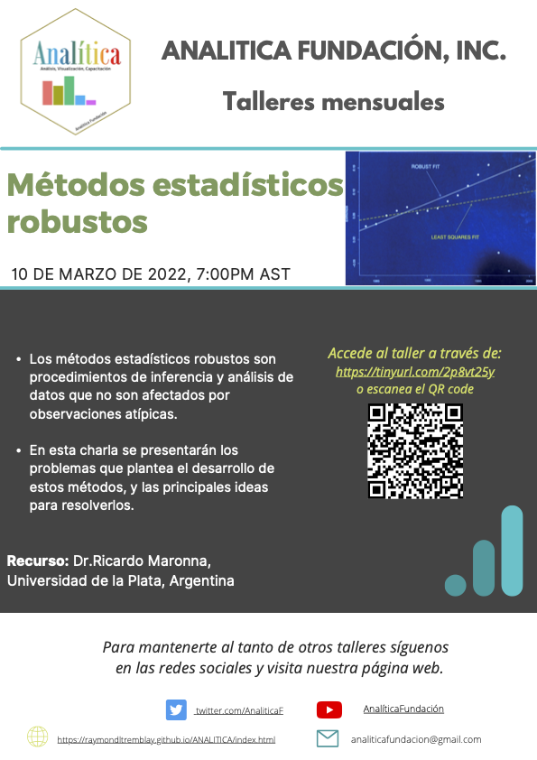

```{r setup, include=FALSE}
knitr::opts_chunk$set(echo = TRUE)
```

***

# Introducción a Métodos Estadísticos Robustos

- Dia del Taller: el 10 de marzo, 2022
- Recurso: Ricardo Morenna, PhD
- Asociación Académida: **Universidad de la Plata, Argentina**
- Correo electronico: rmaronna@retina.ar


***

## Presentación Power point de la activcidad

[La presentación](Presentaciones/Maronna_Webinar-03-22.pdf) 


***

## Video de la Presentación

## YOUTUBE ANALITICA Fundación

 - Enlaces para acceso a los Videos

Los sigientes enlaces corresponde a la presentación abajo

[Video_1]()

[Video_2]()

[Video_3]()

[Video_4]()


***


## Recursos Suplementario

Recursos disponible sobre Métodos Estadísticos Robustos

[Enlace al nuevo libro del Dr. Morenna en español](https://www.ic.fcen.uba.ar/noticias/nuevo-libro-de-ricardo-maronna)

[Libro en Amazon](https://www.amazon.com/dp/1119214688/ref=cm_sw_em_r_mt_dp_E6EMSVK1HC94BW60RCNC)


### Anuncio del taller



